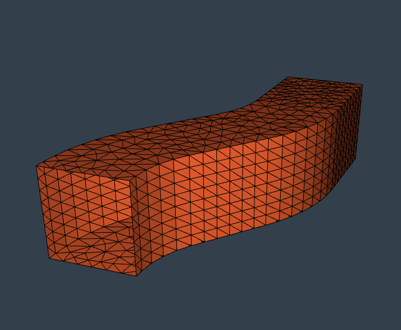
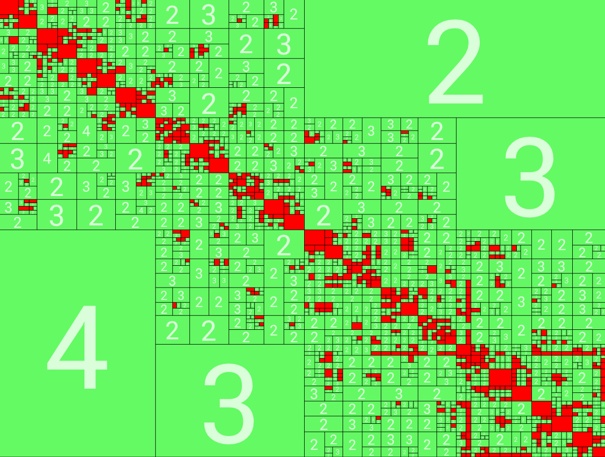

class: title-slide

# Robust coarse spaces for the boundary element method

### Xavier Claeys, .underline[Pierre Marchand], Frédéric Nataf

26 February 2019 - University of Konstanz

### .font50[Team-project Alpines, Inria and Laboratoire J.-L. Lions, Sorbonne Université]

---

# Overview

## Boundary Integral Equation (BIE)

- Reformulation on $\partial \Omega$ using its fundamental solution
- Non-local integral operators
- Full matrices using Galerkin approximation

.center[]

---

# Overview

## Domain Decomposition Methods (DDM)

- Schwarz method used as preconditioner
- GenEO (Generalized Eigenproblems in the Overlap)

---

# Overview

## Some practical difficulties

- Compression ($\mathcal{H}$-matrices, Fast multipole method...)
- Parallelism and vectorisation (MPI, OpenMP)

--

.center[$\implies$ *Htool library by P.-H. Tournier and P.M. (available on [GitHub](https://github.com/PierreMarchand20/htool)* <i class="fab fa-github" style="color:#4C4B4C"></i>)]

.center[]

---

# Function spaces

## Notations

- $\Omega \subset \bbR^2$ or $\bbR^3$ a Lipschitz domain and $\Gamma\subseteq \partial \Omega$
- Defining $H^{1/2}(\partial \Omega)$ using local maps and $H^{-1/2}(\partial \Omega)$ by duality,

$$
    \begin{aligned}
    H^s(\Gamma):= \\{ u\lvert_{\Gamma} \, \lvert \,  u \in H^{1/2}(\partial \Omega) \\}, \quad\wH^{1/2}(\Gamma):= \\{ u \in H^{1/2}(\partial \Omega) \, \lvert \,  \operatorname{supp}(u) \subset \overline{\Gamma} \\}.
    \end{aligned}
$$

with *Sobolev-Slobodeckij* norm

$$
\begin{aligned}
\lVert u \rVert\_{H^s(\partial \Omega)}^2 &:= \lVert u \rVert\_{L^2(\partial \Omega)}^2 + \int\_{\partial \Omega \times \partial \Omega } \dfrac{\lvert u(\bfx) - u(\bfy) \rvert^2 }{\bfx - \bfy} \diff s(\bfx,\bfy) \\\
\lVert u \rVert\_{\wH^s(\Gamma)}&:=\lVert E\_{\Gamma} (u) \rVert\_{H^s(\partial \Omega)}\, \text{with }E\_{\Gamma}\text{ the extension by zero}
\end{aligned}
$$

--

> **Remarks**:
>
> - $\wH^1(\Gamma)=H^1\_0(\Gamma)$ but $\wH^{1/2}(\Gamma)=H\_{00}^{1/2}(\Gamma)$,
> - If $\Gamma=\partial \Omega$ ($\partial \Gamma = \emptyset$), then $H^s(\Gamma)=\wH^s(\Gamma)$ for $\lvert s \lvert \leq 1$,
> - $\wH^s(\Gamma)=H^s(\Gamma)$ for $0\leq s <1/2$;

---

# Model problem

$$
\left\\{
    \begin{aligned}
    &L(u) = 0 \quad \text{ in }\Omega \subset \bbR^d \\\
    &+\text{ condition at infinity if }\Omega\text{ is an exterior domain}
    \end{aligned}
\right.
$$
where $L$ is a general linear, elliptic differential operator with constant coefficient and $d=2$ or $3$.

> **Fundamental solution**
> $$
> L(G)= \delta_0\text{ in }\bbR^d
> $$

 
--

> **Example**: Laplacian in $\bbR^d$
> $$
> G(\bfx):=\dfrac{1}{4\pi \lVert \bfx\rVert}
> $$

---

# Surface potentials

## Single and double layer potentials

$$
    \begin{aligned}
    &\operatorname{SL}(q)(\bfx):=\int\_{\Gamma} G(\bfx-\bfy)q(\bfy) \diff \sigma(\bfy),\\\
    &\operatorname{DL}(v)(\bfx):=\int\_{\Gamma} \bfn(\bfy)\cdot (\nabla G)(\bfx-\bfy)v(\bfy) \diff \sigma(\bfy),
    \end{aligned}
$$
with $v \in \wH^{1/2}(\Gamma)$, $q \in \wH^{-1/2}(\Gamma)$ and $\bfx \in \bbR^d \setminus \Gamma$.

> - $L\circ SL(q)=0$ and $L\circ DL(v)=0$ in $\mathbb{R}^d \setminus \Gamma$
> - $ SL(q)$ and $ DL(v)$ satisfy appropriate conditions at infinity

---

# Boundary Integral Equations

## Dirichlet (resp. Neumann) problem

- Dirichlet data $g_D\in H^{1/2}(\Gamma) \implies V(q)=g_D$ with $V=\gamma_D \circ SL$

--

- Neumann data $g_N\in H^{-1/2}(\Gamma) \implies W(v)=g_N$ with $W=\gamma_N \circ DL$

--

## Variational formulation

Find $u\in \wH^{1/2}(\Gamma)$ such that $a\_W(u,v) = \langle g\_N, v\rangle_{H^{-1/2}(\Gamma)\times \wH^{1/2}(\Gamma)} , \forall v \in \wH^{1/2}(\Gamma)$.

--

## Discretisation

Find $u\_h\in \calV\_h$ such that $a\_W(u,v) = \langle g\_N, v\rangle_{H^{-1/2}(\Gamma)\times \wH^{1/2}(\Gamma)} , \forall v \in \calV\_h$, with $\calV\_h=\Span(\varphi_i,i=1\dots N)$.

--

.center[.alert[Hypothesis: a is symmetric positive definite]]

---

# Boundary Integral Method

- Laplace equation on screens, Laplace equation with Dirichlet conditions on closed surface, Dissipative Helmholtz
- Example of analytical expression for Laplacian in 3D:

$$
    \langle V(q), \varphi \rangle= \int\_{\Gamma}\int\_{\Gamma} \dfrac{1}{4\pi \lVert \bfx-\bfy \rVert}q(\bfy) \varphi (\bfx) \diff s\_{\bfy} \diff s\_{\bfx}
$$

--

--- 

$$
        \bfA\_h \bfu\_h = \bff,
$$
with $u\_h = \sum\_{i=1}^N (\bfu\_h)\_i \varphi\_i$ and $(\bfA\_h)\_{i,j}=a\_W(\varphi\_j, \varphi\_i)$.

- Conditioning number for the linear system associated with the preceding bilinear form and obtained with finite element:

$$
    \kappa(\bfA\_h)\leq C h^{-1}.
$$

---

# Solvers

- Direct methods:
    - Expensive for dense matrices (complexity in $O(N^3)$),
    - Possibility to use $\mathcal{H}-LU$ decomposition.

- Iterative methods:
    - Only matrix vector products ($O(N^2)$ or quasi linear complexity with compression),
    - But ill-conditioned, especially when the mesh is refined.

--

$\implies$ .alert[preconditioning techniques]: we are looking for $\bfP$ so that
$$
    \bfP \bfA\_h u\_h = \bfP \bff,
$$
where $\bfP \bfA\_h$ has a better condition number.

---

# Warning about DDM

There are different points of view with DDM !

- .alert[Volume domain decomposition] THEN boundary integral formulation: PMCHWT formulation, Boundary Element Tearing and Interconnecting (BETI) methods, Multitrace formulation.

--

- Boundary integral formulation THEN .alert[surface domain decomposition]: Additive Schwarz Method (ASM)

---

# Notations

## Subdomains

- $\Gamma_p \subset \widetilde{\Gamma}_p:=\cup \{ \supp(\varphi_i)\vert \supp(\varphi_i)\cap \Gamma_p \neq \emptyset\}$

## Overlap

- $\delta\_p:=\inf\_{\bfx\in \Gamma \setminus \widetilde{\Gamma}\_p} \dist (\bfx,\widetilde{\Gamma}\_p\setminus \cup\_{j\neq p}\widetilde{\Gamma}\_j)$,

## Decomposition

- Number of unknowns in the subdomain $p$: $N\_p$,
- Extension by zero: $\bfR^T_p \in \bbR^{N \times N_p}$,
- Restriction matrices: $\bfR_p$
- Partition of unity: diagonal matrices $\bfD\_p\in \bbR^{N\_p \times N\_p}$ s.t.

$$
    \sum_{p=1}^n \bfR_p^T \bfD_p \bfR_p = \bfI_d.
$$

---

# Additive Schwarz Preconditioner

$$
    \bfP\_{ASM} = \bfR\_0^T (\bfR\_0 \bfA\_h \bfR\_0^T)^{-1} \bfR\_0+\sum^n\_{p=1} \bfR\_p^T (\bfR\_p \bfA\_h \bfR\_p^T)^{-1} \bfR\_p
$$
where $\bfR\_0^T$ is an interpolation operator from the **coarse space** to the finite element space.

- $\bfZ=\bfR\_0^T \in \bbR^{N \times N_0}$ for $N\_0>0$,
- The coarse space $V\_{h,0}$ is spanned by the columns of $\bfZ$.

> **Scalability**
>
> *Strong scalability*: ”How the solution time varies with the number of processors for a fixed total problem size”
>
> *Weak scalability*: ”How the solution time varies with the number of processors for a fixed total problem size”

---

# Fictious Space Lemma

Let us denote
$$
    \mathcal{R}\_{ASM}(u\_D):=\sum\_{p=0}^n \bfR^T\_p \bfu\_h^p, \quad \forall u\_D=(\bfu\_h^p)\_{p=0}^n\in H\_D=\prod\_{p=0}^n \bbC^{N\_p} ,
$$

--

If we have the following hypothesis

- (H1) $\mathcal{R}\_{ASM}$ is surjective,
- (H2) $\lVert \mathcal{R}\_{ASM}(u\_D)\rVert\_{\bfA\_h}^2\leq c\_R \sum\_{p=0}^n \lVert \bfR\_p^T \bfu\_h^p \rVert\_{\bfA\_h}^2 \quad \forall (\bfu\_h^p)\_{p=0}^n \in H\_D$,
- (H3) For $\bfu\_h \in \bbR^N$, we can define $u\_D \in H\_D$ s.t. $\bfu\_h=\mathcal{R}\_{ASM}(u\_D)$ and

$$
    c\_T \sum\_{p=0}^n \lVert \bfR^T\_p \bfu\_h^p \rVert\_{\bfA\_h}^2 \leq \lVert \bfu\_h \rVert\_{\bfA\_h}^2,
$$

Then
$$
    \kappa (\bfP\_{ASM}\bfA\_h) \leq \dfrac{c\_R}{c\_T}.
$$

---

# 