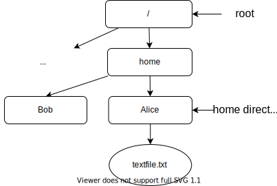

class: title-slide

# Quick start to coding - 012

### Pierre Marchand

### .font50[Team-project POEMS, Inria, ENSTA and IPP]

???

- Give email address
- Give the link of the website so that they can access to the sources
- Use `C` to open another window linked to the original window (one can be used in presentation mode)

---

class: left

# About this course

## Goal

- Tools to help you code (1 or 2 lectures)
- Basics of modern C++ (4-5 lectures)

???

--

## Schedule

- Wednesday at 14:00
- Friday at 14:00

--

## Remarks

- This is course is not graded → 🎉🎉🎉
- This course is very short → *It is only a starting point from which you can start learning*
- First time this course is given → *Constructive comments are welcome*

---

# Learning content

Everything is available on my [webpage](https://pierremarchand.netlify.app):

- <https://pierremarchand.netlify.app>

--

You can find

- these [slides](https://pierremarchand20.github.io/slides/2022_07_012_course) (see Teaching)
    - you can open them in a browser to follow this course
--
- [Computer tools](https://pmarchand.pages.math.cnrs.fr/computertools/#computer-tools-and-coding-workflow) (see Project, or these slides)
    - contains *introductions to useful/necessary tools for coding*
    - pointers to other resources are also given
    - available as a website or a pdf file
--
- [C++ Quick Start]() (see Teaching, or these slides)
    - *quick introduction to C++*
    - pointers to other resources are also given
    - available as a website or a pdf file

???

- Say that they are all available via a browser. 
- Wait for them to have it open.

---

# Setup requirements

## Unix-like systems? (Linux, macOS, ...)

→ you are good to go 👍👍👍

--

## Windows?

- Windows 10 version 2004 and higher (Build 19041 and higher) or Windows 11

    → Install [WSL 2](https://docs.microsoft.com/en-us/windows/wsl/install)

- a x64 system with Version 1903 or later, with Build 18362 or later

    → Install [manually WSL 2](https://docs.microsoft.com/en-us/windows/wsl/install)

- Otherwise, I mention other alternatives [here](https://pmarchand.pages.math.cnrs.fr/computertools/introduction/setup.html#about-windows).

*Remark*: To check your version and build number, select `Windows logo key + R`, type `winver`, select `OK`.

---

# Source code editor

## VS Code

You can use any source code editor you want, in doubts, I recommend [VS Code](https://code.visualstudio.com)
.abs-layout.width-20.right-5.top-30[]

- free
- cross-platform
- multipurpose
- extensible via extensions

See [here](https://pmarchand.pages.math.cnrs.fr/computertools/introduction/setup.html#visual-studio-code) for more information.

## Advices

- Take the time to learn how to use it (see [here](https://pmarchand.pages.math.cnrs.fr/computertools/introduction/setup.html#where-to-start) for references)
- On Windows, use VS Code with the extension [Remote WSL](https://marketplace.visualstudio.com/items?itemName=ms-vscode-remote.remote-wsl)

---

# Computer tools

## Basic tools

Before learning about C++, or any programming languages, it is important to introduce the following tools:

- bash
- git
- SSH

--

## Motivation

- The tools we will see are useful with all languages (Python, C++, LaTeX, ...)
- These are transversal skills that you can put forward and develop in your future career.

---

# Terminal/bash

## Why?

- Alternative to GUI which allows scripting and uses less resources
- Potentially more efficient than manipulating graphical elements
- Necessary to access remote servers (i.e, supercomputers)

--

## Filesystem

.abs-layout.width-44.left-5[Files are organized in a *hierarchical tree structure*.]

.abs-layout.width-44.right-5[]

.abs-layout.width-44.center.alert.left-5.bottom-30.font130[**To your terminal!**]

???

- Explain the terminology (cli/shell, prompt and terminal)
- Quickly mention variables

---

# git

.abs-layout.width-20.right-5[.right[]]

*Decentralized version control system* for [source code](https://en.wikipedia.org/wiki/Source_code)

???
version control system: source code is usually **plain text** -> `.py`, `.tex`, `.marshmallow`...

--

Several use cases:
- <i class="fas fa-user-alt fa-2x" style="color:#4C4B4C"></i> with <i class="fas fa-laptop fa-2x" style="color:#4C4B4C"></i>: **versioning**,

???
git scales ! from your article/proto code to Linux kernel and Windows
--

- <i class="fas fa-user-alt fa-2x" style="color:#4C4B4C"></i> with <i class="fas fa-laptop fa-2x" style="color:#4C4B4C"></i> with <i class="fas fa-at fa-2x" style="color:#4C4B4C"></i>: **versioning** and **backup**,

--

- <i class="fas fa-user-alt fa-2x" style="color:#4C4B4C"></i> with <i class="fas fa-laptop fa-sm" style="color:#4C4B4C"></i><i class="fas fa-laptop fa-sm" style="color:#4C4B4C"></i><i class="fas fa-laptop fa-sm" style="color:#4C4B4C"></i> with <i class="fas fa-at fa-2x" style="color:#4C4B4C"></i>: **versioning**, **backup** and **synchronization**,

--

- <i class="fas fa-users fa-2x" style="color:#4C4B4C"></i> with <i class="fas fa-laptop fa-sm" style="color:#4C4B4C"></i><i class="fas fa-laptop fa-sm" style="color:#4C4B4C"></i><i class="fas fa-laptop fa-sm" style="color:#4C4B4C"></i> with <i class="fas fa-at fa-2x" style="color:#4C4B4C"></i>: **versioning**, **backup**, **synchronization** and **collaborative work**.

--

.alert.center.font130[**To your terminal!**]

---

# SSH

The Secure Shell (SSH) protocol is a network protocol that allows secure access to systems running an SSH server over a network (e.g. the Internet)

--

SSH is widely used, examples of applications are

- accessing severs remotely (student workspace hosted by the school, supercomputers, git servers, remote workstation, ...) with or without password,
- transferring or syncing files,
- mounting a directory on a remote server as a local filesystem.

--

.alert.center.font130[**To your terminal!**]

---

# C++ Quick Start

Work in progress
